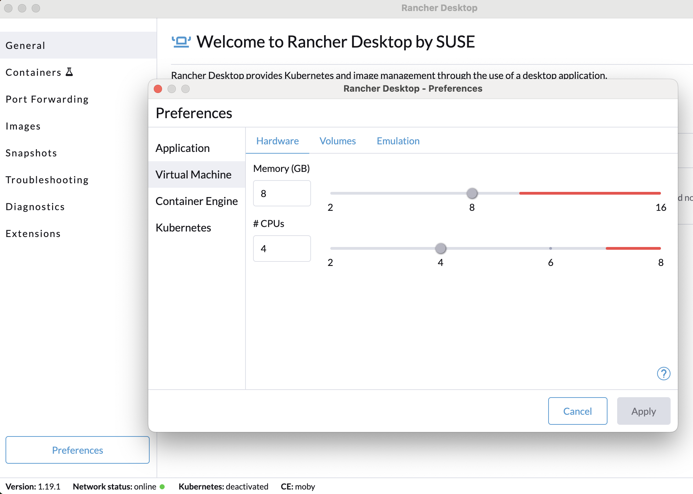

This project demonstrates how to provision and manage AWS resources (specifically an S3 bucket) from a local Kubernetes cluster using [Crossplane](https://crossplane.io).

The entire workflow is automated via a single shell script (`provisioner.sh`) that sets up a local [Kubernetes `kind`](https://kind.sigs.k8s.io/) cluster, installs Crossplane, configures the AWS provider, and provisions an S3 bucket. This setup runs locally within [Rancher Desktop](https://rancherdesktop.io/) or any other container runtime that supports `kind`.

Uses the example from [AWS Quickstarts](https://docs.crossplane.io/latest/getting-started/provider-aws/), with additional automation.

Source available from [github.com](https://github.com/tomconn/kind-crossplane-aws-s3).

## How It Works

The magic of Crossplane is its ability to extend the Kubernetes API. Instead of managing `Pods` and `Deployments`, you can manage cloud resources like `Buckets` and `Databases` with `kubectl apply`.

The process is as follows:
  1.  **Local Cluster**: The `provisioner.sh` script first creates a local multi-node Kubernetes cluster using `kind`.
  2.  **Crossplane Installation**: It then uses Helm to install Crossplane into the `crossplane-system` namespace.
  3.  **Provider Configuration**:
    *   It installs the Crossplane `provider-aws-s3`, which contains the controllers needed to manage AWS S3 resources.
    *   It securely reads your local `~/.aws/credentials` file and creates a Kubernetes `Secret` in the cluster.
    *   It applies a `ProviderConfig` resource, which tells the AWS provider how to authenticate with AWS by referencing the newly created `Secret`.
  4.  **Resource Provisioning**:
    *   You apply a simple YAML manifest defining an S3 `Bucket`.
    *   Crossplane's AWS provider controllers detect this new custom resource.
    *   The provider uses the configured credentials to make API calls to AWS, creating the actual S3 bucket.
  5.  **Cleanup**: The script can also tear down all created resources, including the S3 bucket and the local `kind` cluster.

## Prerequisites

Before you begin, ensure you have the following tools installed and configured:

*   **[Rancher Desktop](https://rancherdesktop.io/)** or Docker Desktop. Ensure enough CPU and RAM is allocated 
*   **[AWS CLI](https://aws.amazon.com/cli/)**: Must be configured with your credentials. The script specifically looks for `~/.aws/credentials`.
*   **[Kubernetes `kind`](https://kind.sigs.k8s.io/)**: For running a local Kubernetes cluster.
*   **[Helm](https://helm.sh/)**: For installing Crossplane.

## Setup

  1.  Clone this repository:
    ```sh
    git clone <your-repo-url>
    cd <repo-name>
    ```

  2.  Ensure your AWS credentials are in place at `~/.aws/credentials`. The script will use the `[default]` profile.
    ```ini
    # File: ~/.aws/credentials
    [default]
    aws_access_key_id = YOUR_AWS_ACCESS_KEY
    aws_secret_access_key = YOUR_AWS_SECRET_KEY
    ```

## Usage

The `provisioner.sh` script handles the entire lifecycle.

### Provision Resources

This command will create the `kind` cluster, install Crossplane, configure the AWS provider, and create the S3 bucket defined in `crossplane/02-s3.yaml`.

```sh
bash ./provisioner.sh
```

After the script completes, you can verify that the bucket was created in the AWS console or by using the AWS CLI:
```sh
# Get the bucket name from Kubernetes
BUCKET_NAME=$(kubectl get bucket -o jsonpath='{.items[0].metadata.name}')

# Check if the bucket exists in AWS
aws s3 ls "s3://${BUCKET_NAME}"
```

### Clean Up

This command will delete the S3 bucket from AWS and then destroy the local `kind` cluster.

```sh
bash ./provisioner.sh cleanup
```

---

## Code and Configuration Deep Dive

### `provisioner.sh`

This is the main orchestration script. It is idempotent, meaning it can be run multiple times without causing errors. It checks for the existence of resources before attempting to create them.

Key functions:
*   `create_cluster()`: Creates the `kind` cluster using `kind-cluster.yaml`.
*   `install_crossplane()`: Installs Crossplane using a specific Helm chart version.
*   `configure_aws_provider()`: Creates the Kubernetes secret from AWS credentials, applies the `Provider` and `ProviderConfig`, and waits for the provider to become healthy.
*   `provision_resources()`: Applies the `crossplane/02-s3.yaml` manifest to create the S3 bucket.
*   `cleanup()`: Deletes the Kubernetes resources and the `kind` cluster.

```sh
#!/bin/bash
set -e

# --- Script Setup ---
SCRIPT_DIR=$( cd -- "$( dirname -- "${BASH_SOURCE[0]}" )" &> /dev/null && pwd )
GREEN='\033[0;32m'; YELLOW='\033[1;33m'; RED='\033[0;31m'; NC='\033[0m'

# --- Configuration ---
CLUSTER_NAME="crossplane-demo"
KIND_CONFIG="${SCRIPT_DIR}/kind-cluster.yaml"
AWS_CREDS_FILE="${HOME}/.aws/credentials"
K8S_AWS_SECRET_NAME="aws-secret"
CROSSPLANE_NAMESPACE="crossplane-system"
CROSSPLANE_HELM_VERSION="1.16.0"
AWS_REGION="ap-southeast-2"

# --- Pre-flight Checks ---
if ! command -v aws &> /dev/null; then echo -e "${RED}ERROR: aws CLI not found.${NC}"; exit 1; fi
if ! command -v kind &> /dev/null; then echo -e "${RED}ERROR: kind not found.${NC}"; exit 1; fi
if ! command -v helm &> /dev/null; then echo -e "${RED}ERROR: helm not found.${NC}"; exit 1; fi

# --- Functions ---
function create_cluster() {
    echo -e "${GREEN}### Step 1: Creating Kind Cluster... ###${NC}"
    if ! kind get clusters | grep -q "^${CLUSTER_NAME}$"; then
        kind create cluster --name "${CLUSTER_NAME}" --config "${KIND_CONFIG}"
    else
        echo -e "${YELLOW}Kind cluster already exists. Skipping.${NC}"
    fi
}
function install_crossplane() {
    echo -e "\n${GREEN}### Step 2: Installing Crossplane... ###${NC}"
    if ! helm status crossplane -n "${CROSSPLANE_NAMESPACE}" &> /dev/null; then
        helm repo add crossplane-stable https://charts.crossplane.io/stable; helm repo update
        helm install crossplane --namespace "${CROSSPLANE_NAMESPACE}" --create-namespace crossplane-stable/crossplane --version "${CROSSPLANE_HELM_VERSION}" --wait
    else
        echo -e "${YELLOW}Crossplane is already installed. Skipping.${NC}"
    fi
}
function configure_aws_provider() {
    echo -e "\n${GREEN}### Step 3: Configuring AWS Provider... ###${NC}"
    if [ ! -f "${AWS_CREDS_FILE}" ]; then echo "AWS credentials not found"; exit 1; fi

    # Apply credentials first
    kubectl create secret generic "${K8S_AWS_SECRET_NAME}" -n "${CROSSPLANE_NAMESPACE}" --from-file=creds="${AWS_CREDS_FILE}" --dry-run=client -o yaml | kubectl apply -f -

    # Apply the provider package definition
    kubectl apply -f "${SCRIPT_DIR}/crossplane/00-provider.yaml"

    echo "Waiting 30s for initial provider pods to appear..."
    sleep 30

    echo "Forcing a restart of the provider pods to ensure clean initialization..."
    kubectl delete pods -n "${CROSSPLANE_NAMESPACE}" -l "pkg.crossplane.io/provider=provider-aws-s3" --ignore-not-found=true

    echo "Waiting for Provider package to become healthy..."
    # This wait is now more reliable as it's for the restarted pods
    kubectl wait "provider.pkg.crossplane.io/provider-aws-s3" --for=condition=Healthy --timeout=5m

    # Apply the provider config
    kubectl apply -f "${SCRIPT_DIR}/crossplane/01-providerconfig.yaml"

    echo -e "${GREEN}AWS Provider is fully configured and healthy.${NC}"
}
function provision_resources() {
    # The rest of the script remains the same as the working direct-resource version
    echo -e "\n${GREEN}### Step 4: Provisioning AWS Resources Directly... ###${NC}"

    kubectl create -f "${SCRIPT_DIR}/crossplane/02-s3.yaml"
    #kubectl wait buckets.s3.aws.upbound.io -l app=my-s3-bucket --for=condition=Ready=True --timeout=2m

    echo -e "\n${GREEN}--- PROVISIONING COMPLETE ---${NC}"
}
function cleanup() {
    # ...
    echo -e "\n${GREEN}### Cleaning up all resources... ###${NC}"
    BUCKET_NAME=$(kubectl get buckets -o custom-columns=NAME:.metadata.name --no-headers | grep '^crossplane-bucket-')
    kubectl delete bucket $BUCKET_NAME --ignore-not-found=true
    sleep 5
    deleteKindCluster
    echo -e "${GREEN}Cleanup complete.${NC}"
}
function deleteKindCluster() {
    kind delete cluster --name "${CLUSTER_NAME}"
    rm -f "${SCRIPT_DIR}/crossplane/*-runtime.yaml"
}

# --- Main Execution ---
if [ "$1" == "cleanup" ]; then
    cleanup
else
    create_cluster
    install_crossplane
    configure_aws_provider
    provision_resources
fi
```

### `kind-cluster.yaml`

This file defines the `kind` cluster topology. Here, we create a 3-node cluster (1 control-plane, 2 workers). The `extraMounts` for `/var/run/docker.sock` are pointed to `/dev/null` to explicitly prevent the cluster nodes from accessing the host's Docker daemon, which is a good security practice when not needed.

```yaml
kind: Cluster
apiVersion: kind.x-k8s.io/v1alpha4
nodes:
- role: control-plane
  # give the control-plane a little more memory
  extraMounts:
  - hostPath: /dev/null
    containerPath: /var/run/docker.sock
- role: worker
  # give the workers a little more memory
  extraMounts:
  - hostPath: /dev/null
    containerPath: /var/run/docker.sock
- role: worker
  extraMounts:
  - hostPath: /dev/null
    containerPath: /var/run/docker.sock
```

### `crossplane/00-provider.yaml`

This manifest tells Crossplane to download, install, and run the `provider-aws-s3`. This is a community-contributed provider package.

```yaml
apiVersion: pkg.crossplane.io/v1
kind: Provider
metadata:
  name: provider-aws-s3
spec:
  package: xpkg.crossplane.io/crossplane-contrib/provider-aws-s3:v1.21.1
```

### `crossplane/01-providerconfig.yaml`

This `ProviderConfig` configures the installed provider. It tells the provider how to authenticate with AWS. The `credentials` section points to the Kubernetes `Secret` that the `provisioner.sh` script creates.

```yaml
apiVersion: aws.upbound.io/v1beta1
kind: ProviderConfig
metadata:
  name: default
spec:
  credentials:
    source: Secret
    secretRef:
      namespace: crossplane-system
      name: aws-secret
      key: creds
```

### `crossplane/02-s3.yaml`

This is the manifest for the desired AWS resource. It looks like a standard Kubernetes object, but its `kind` is `Bucket`. Crossplane's provider controller will see this and provision a matching bucket in AWS.

> **Note**: S3 bucket names must be globally unique. The name below includes a placeholder. You may need to change it if it's already taken.

```yaml
apiVersion: s3.aws.upbound.io/v1beta1
kind: Bucket
metadata:
  # This bucket name must be globally unique!
  name: crossplane-bucket-demo-a1b2c3d4e5f6
spec:
  forProvider:
    # This must match the region specified in provisioner.sh
    region: ap-southeast-2
  # This tells the bucket which provider configuration to use for authentication
  providerConfigRef:
    name: default
```